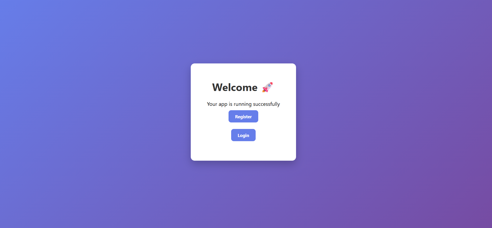
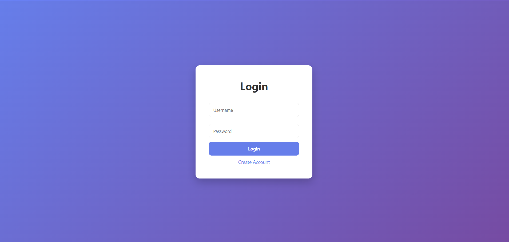
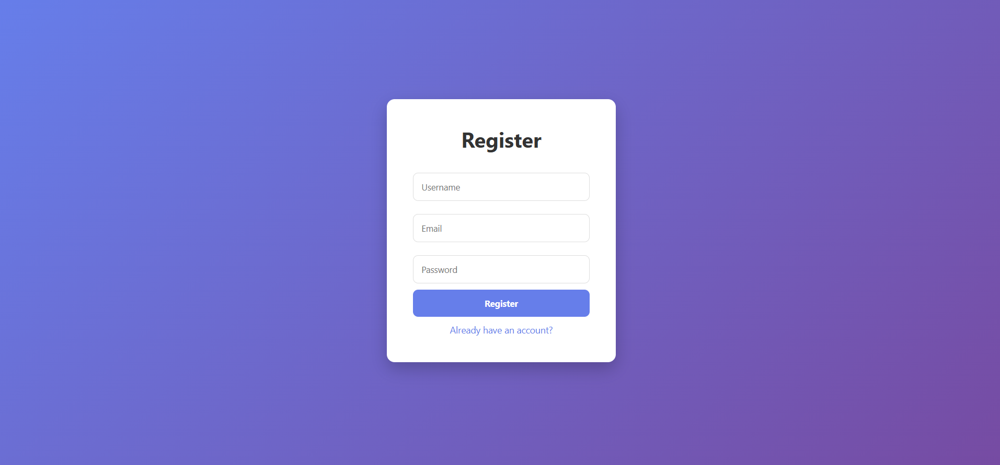

# 🔐 Node.js Authentication System

A full-stack authentication system built using Node.js, Express, MongoDB, and EJS.  
This project demonstrates user registration, login, session management, and protected routes.

---

## 🚀 Features

- 🔑 User Registration (with hashed passwords)
- 🔐 Secure Login Authentication (bcrypt)
- 🧠 Session-based Authentication
- 🔒 Protected Dashboard Route
- 🚪 Logout functionality
- 🎨 Clean UI using custom CSS

---

## 🛠️ Tech Stack

- **Backend:** Node.js, Express.js  
- **Database:** MongoDB (Mongoose)  
- **Frontend:** EJS (Embedded JavaScript Templates)  
- **Authentication:** bcrypt + express-session  

---

## 📁 Project Structure
project/
│── models/
│ └── User.js
│
│── views/
│ ├── login.ejs
│ ├── register.ejs
│ ├── main.ejs
│ └── dash.ejs
│
│── public/
│ └── style.css
│
│── app.js
│── package.json
│── README.md
│── screenshots/
│   ├── home.png
│   ├── login.png
│   └── dashboard.png
|   └──Register.png

---

## ⚙️ Installation & Setup

### 1. Clone the repository

```bash
git clone https://github.com/YOUR_USERNAME/node-auth-app.git
cd node-auth-app

2. Install dependencies
npm install

3. Start MongoDB

Make sure MongoDB is running locally:

run mongod

4. Run the server
node app.js

5. Open in browser

👉 http://localhost:3000

## 📸 Screenshots

### 🏠 Home Page


### 🔐 Login Page


### 📊 Dashboard

### Register Page

🔐 Authentication Flow
User registers → password is hashed using bcrypt
User logs in → credentials verified
Session is created → user stays logged in
Protected routes (like dashboard) require login
Logout destroys session

🧠 Future Improvements
Flash messages (error/success UI)
JWT-based authentication
Password reset functionality
MongoDB Atlas integration
Deployment (Render / Railway)
Improved UI (Tailwind CSS / animations)
📌 Learning Outcomes
Understanding authentication flow
Working with sessions & cookies
Password hashing using bcrypt
MVC structure in Express apps
Connecting Node.js with MongoDB
👨‍💻 Author

Dilshaan-Gill
Aspiring AI & Full-Stack Developer 🚀

⭐ Support

If you like this project, consider giving it a ⭐ on GitHub!